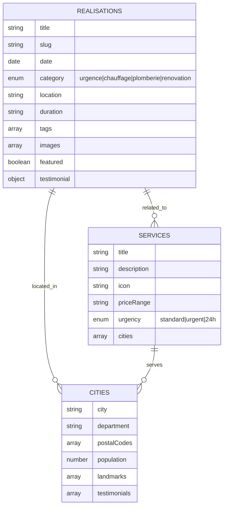

# feat: Site Web Plomberie Rambouillet - Plateforme GEO-Optimisée

## Overview

Création d'un site web complet pour un artisan plombier-chauffagiste à Rambouillet (78120), optimisé pour les moteurs de recherche génératifs (GEO) et le SEO local. Le site utilise Astro 5.0 avec architecture Islands, déployé sur Cloudflare Pages.

**Stack technique:**
- Framework: Astro 5.0 (génération statique)
- Styling: Tailwind CSS 4
- Composants interactifs: React (Islands)
- Hébergement: Cloudflare Pages
- Images: Sharp (WebP/AVIF)

## Problem Statement / Motivation

### Contexte métier
- **Eau dure à Rambouillet** (TH ~25°f) → Besoin de contenu sur détartrage et adoucisseurs
- **Centre-ville classé SPR** → Contraintes ABF pour modifications en façade
- **Transition SEO → GEO** → Les moteurs IA (Google SGE, ChatGPT Search, Perplexity) deviennent prépondérants

### Pourquoi ce projet
1. **Performance**: Sites Astro atteignent 98-100 Lighthouse nativement
2. **Coût minimal**: Hébergement Cloudflare Pages gratuit
3. **Maintenabilité**: Collections de contenu en Markdown/MDX
4. **GEO-ready**: Données structurées Schema.org pour citation par IA

## Proposed Solution

Site statique multi-pages organisé en silos sémantiques:
- `/urgence/` - Services d'urgence 24/7
- `/chauffage/` - Installation et entretien
- `/plomberie/` - Services sanitaires et traitement d'eau
- `/realisations/` - Galerie avant/après avec témoignages
- `/zone-intervention/` - Pages locales par commune

## Technical Approach

### Architecture

```
rambouillet-plomberie/
├── CLAUDE.md                    # Configuration Claude Code
├── src/
│   ├── components/
│   │   ├── global/              # Header, Footer, StickyBottomBar
│   │   ├── ui/                  # Button, Card, Modal
│   │   ├── sections/            # Hero, TrustBar, ServiceGrid
│   │   └── gallery/             # RealisationCard, Lightbox
│   ├── content/
│   │   ├── config.ts            # Schémas Zod des collections
│   │   ├── services/            # Pages de services (MDX)
│   │   ├── cities/              # Pages locales (MDX)
│   │   └── realisations/        # Galerie (MDX + images)
│   ├── layouts/
│   │   ├── Layout.astro         # Layout principal
│   │   └── ServiceLayout.astro  # Layout services
│   └── pages/
│       ├── index.astro          # Homepage
│       ├── contact.astro        # Formulaire contact
│       ├── mentions-legales.astro
│       ├── politique-confidentialite.astro
│       ├── 404.astro            # Page erreur
│       ├── realisations/
│       ├── urgence/
│       ├── chauffage/
│       ├── plomberie/
│       └── zone-intervention/
├── public/
│   ├── images/
│   ├── favicon.ico
│   └── robots.txt
├── scripts/
│   └── generate-gallery.mjs     # Helper création réalisations
├── astro.config.mjs
├── package.json
└── tailwind.config.mjs
```

### ERD - Collections de Contenu



### Implementation Phases

#### Phase 1: Foundation (Setup & Configuration)

**Objectif:** Initialiser le projet avec toute la configuration nécessaire.

**Fichiers à créer:**
- [ ] `package.json` - Dépendances Astro 5, React, Tailwind, Sharp
- [ ] `astro.config.mjs` - Configuration static output, integrations
- [ ] `tailwind.config.mjs` - Configuration Tailwind avec couleurs métier
- [ ] `tsconfig.json` - Configuration TypeScript
- [ ] `CLAUDE.md` - Contexte métier pour Claude Code
- [ ] `src/content/config.ts` - Schémas Zod des collections
- [ ] `public/robots.txt` - Directives crawlers (incluant AI bots)
- [ ] `.gitignore` - Fichiers à ignorer

**Commandes:**
```bash
npm create astro@latest . -- --template minimal --typescript strict
npm install @astrojs/react @astrojs/sitemap react react-dom sharp
npm install tailwindcss @tailwindcss/vite
```

**Critères de succès:**
- [ ] `npm run dev` démarre sans erreur
- [ ] `npm run build` génère le dossier `dist/`
- [ ] TypeScript compile sans erreur

---

#### Phase 2: Core Components & Layout

**Objectif:** Créer le système de layout et les composants globaux.

**Fichiers à créer:**

**Layout principal - `src/layouts/Layout.astro`:**
```astro
---
import Header from '../components/global/Header.astro';
import Footer from '../components/global/Footer.astro';
import StickyBottomBar from '../components/global/StickyBottomBar.astro';
import SEOHead from '../components/global/SEOHead.astro';

interface Props {
  title: string;
  description: string;
  schema?: object;
}

const { title, description, schema } = Astro.props;
---

<!DOCTYPE html>
<html lang="fr">
  <head>
    <SEOHead title={title} description={description} schema={schema} />
  </head>
  <body>
    <Header />
    <main>
      <slot />
    </main>
    <Footer />
    <StickyBottomBar />
  </body>
</html>
```

**Composants globaux:**
- [ ] `src/components/global/Header.astro` - Navigation responsive, bouton urgence desktop
- [ ] `src/components/global/Footer.astro` - Liens, certifications, contact
- [ ] `src/components/global/StickyBottomBar.astro` - CTA mobile (Appeler + WhatsApp)
- [ ] `src/components/global/SEOHead.astro` - Meta tags, Schema.org JSON-LD

**Composants UI:**
- [ ] `src/components/ui/Button.astro` - Variantes: primary, secondary, outline
- [ ] `src/components/ui/Card.astro` - Card générique avec image
- [ ] `src/components/ui/Badge.astro` - Badges certifications

**Sticky Bottom Bar - `src/components/global/StickyBottomBar.astro`:**
```astro
---
const phone = "+33612345678"; // TODO: Remplacer par vrai numéro
const whatsapp = "33612345678";
---

<nav class="sticky-bar" aria-label="Contact rapide">
  <a href={`tel:${phone}`} class="cta-call">
    <svg><!-- phone icon --></svg>
    <span>Appeler</span>
    <span class="badge">24h/24</span>
  </a>

  <a
    href={`https://wa.me/${whatsapp}?text=${encodeURIComponent("Bonjour, j'ai besoin d'un plombier")}`}
    class="cta-whatsapp"
    target="_blank"
    rel="noopener"
  >
    <svg><!-- whatsapp icon --></svg>
    <span>WhatsApp</span>
  </a>
</nav>

<style>
  .sticky-bar {
    @apply fixed bottom-0 left-0 right-0 flex gap-2 p-3 bg-white shadow-lg z-50;
    padding-bottom: calc(0.75rem + env(safe-area-inset-bottom));
  }

  .cta-call {
    @apply flex-1 flex items-center justify-center gap-2 py-4 rounded-lg bg-red-600 text-white font-semibold;
  }

  .cta-whatsapp {
    @apply flex-1 flex items-center justify-center gap-2 py-4 rounded-lg bg-green-500 text-white font-semibold;
  }

  @media (min-width: 1024px) {
    .sticky-bar { display: none; }
  }
</style>
```

**Critères de succès:**
- [ ] Header responsive avec hamburger menu mobile
- [ ] Footer avec liens légaux et certifications
- [ ] Sticky bar visible uniquement sur mobile
- [ ] Boutons CTA fonctionnels (tel: et wa.me links)

---

#### Phase 3: Homepage & Content Sections

**Objectif:** Créer la page d'accueil avec toutes les sections.

**Fichiers à créer:**

**Homepage - `src/pages/index.astro`:**
```astro
---
import Layout from '../layouts/Layout.astro';
import Hero from '../components/sections/Hero.astro';
import TrustBar from '../components/sections/TrustBar.astro';
import ServiceGrid from '../components/sections/ServiceGrid.astro';
import RecentRealisations from '../components/sections/RecentRealisations.astro';
import LocalArea from '../components/sections/LocalArea.astro';
import Reviews from '../components/sections/Reviews.astro';

const plumberSchema = {
  "@context": "https://schema.org",
  "@type": "Plumber",
  "@id": "https://www.rambouillet-plomberie.fr/#organization",
  "name": "Plomberie Rambouillet Services",
  // ... schema complet
};
---

<Layout
  title="Plombier Rambouillet (78) - Dépannage Urgence 24/7"
  description="Artisan plombier chauffagiste à Rambouillet. Urgence fuite, entretien chaudière, adoucisseur. Intervention sous 30min. Devis gratuit."
  schema={plumberSchema}
>
  <Hero />
  <TrustBar />
  <ServiceGrid />
  <RecentRealisations />
  <LocalArea />
  <Reviews />
</Layout>
```

**Sections à créer:**
- [ ] `src/components/sections/Hero.astro` - Image plombier, headline, CTA
- [ ] `src/components/sections/TrustBar.astro` - Note Google, badges RGE/Qualibat
- [ ] `src/components/sections/ServiceGrid.astro` - 3 cards services principaux
- [ ] `src/components/sections/RecentRealisations.astro` - 3 derniers projets
- [ ] `src/components/sections/LocalArea.astro` - Carte zone intervention
- [ ] `src/components/sections/Reviews.astro` - Témoignages clients

**Critères de succès:**
- [ ] Homepage charge en < 2s (LCP)
- [ ] Schema.org Plumber injecté dans head
- [ ] Toutes sections responsive
- [ ] Trust signals above the fold sur mobile

---

#### Phase 4: Service Pages (Silos Sémantiques)

**Objectif:** Créer les pages de services avec architecture en silos.

**Collections à créer:**

**`src/content/services/urgence/fuite-eau.mdx`:**
```mdx
---
title: "Réparation Fuite d'Eau"
description: "Intervention urgente fuite d'eau à Rambouillet. Détection et réparation sous 30 minutes. 24h/24, 7j/7."
icon: "droplet"
priceRange: "à partir de 89€"
urgency: "24h"
cities: ["rambouillet", "gazeran", "le-perray"]
---

## Fuite d'eau à Rambouillet ? Intervention immédiate

Notre équipe intervient **en moins de 30 minutes** pour toute fuite d'eau à Rambouillet et communes environnantes.

### Nos interventions

- Fuite sous évier ou lavabo
- Canalisation percée
- Robinet qui goutte
- Fuite WC
- Ballon d'eau chaude qui fuit

### Pourquoi choisir notre service ?

✅ **Intervention 24h/24** - même dimanches et jours fériés
✅ **Détection non destructive** - caméra thermique, gaz traceur
✅ **Rapport assurance** - agréé pour déclaration dégât des eaux
✅ **Garantie pièces et main d'œuvre**

### Tarification transparente

| Intervention | Tarif TTC |
|--------------|-----------|
| Déplacement + diagnostic | 89€ |
| Réparation fuite simple | à partir de 120€ |
| Recherche de fuite | sur devis |
```

**Pages dynamiques à créer:**
- [ ] `src/pages/urgence/[slug].astro` - Template pages urgence
- [ ] `src/pages/chauffage/[slug].astro` - Template pages chauffage
- [ ] `src/pages/plomberie/[slug].astro` - Template pages plomberie

**Contenu à créer (MDX):**
- [ ] `/urgence/fuite-eau.mdx`
- [ ] `/urgence/debouchage-wc.mdx`
- [ ] `/urgence/panne-chaudiere.mdx`
- [ ] `/urgence/degat-des-eaux.mdx`
- [ ] `/chauffage/installation-chaudiere-gaz.mdx`
- [ ] `/chauffage/entretien-chaudiere.mdx`
- [ ] `/chauffage/pompe-a-chaleur.mdx`
- [ ] `/chauffage/detartrage.mdx` (prioritaire pour Rambouillet TH 25°f)
- [ ] `/plomberie/adoucisseur-eau.mdx` (prioritaire)
- [ ] `/plomberie/renovation-salle-de-bain.mdx`
- [ ] `/plomberie/recherche-fuite-non-destructive.mdx`

**Critères de succès:**
- [ ] Schema.org Service sur chaque page
- [ ] FAQ intégrée (pour Featured Snippets et GEO)
- [ ] Liens internes entre services liés
- [ ] Contenu unique et technique (pas générique)

---

#### Phase 5: Gallery System (Réalisations)

**Objectif:** Système complet de galerie avant/après avec témoignages.

**Collection schema - `src/content/config.ts`:**
```typescript
const realisationsCollection = defineCollection({
  loader: glob({ pattern: "**/*.md", base: "./src/content/realisations" }),
  schema: ({ image }) => z.object({
    title: z.string(),
    slug: z.string(),
    date: z.coerce.date(),
    category: z.enum(['urgence', 'chauffage', 'plomberie', 'renovation']),
    location: z.string(),
    duration: z.string().optional(),
    tags: z.array(z.string()),
    images: z.array(z.object({
      src: image(),
      alt: z.string(),
      caption: z.string().optional()
    })),
    featured: z.boolean().default(false),
    testimonial: z.object({
      text: z.string(),
      author: z.string(),
      rating: z.number().min(1).max(5)
    }).optional()
  })
});
```

**Fichiers à créer:**
- [ ] `src/pages/realisations/index.astro` - Liste avec filtres
- [ ] `src/pages/realisations/[slug].astro` - Détail projet
- [ ] `src/components/gallery/RealisationCard.astro` - Card preview
- [ ] `src/components/gallery/ImageLightbox.tsx` - Composant React zoom (client:visible)
- [ ] `src/components/gallery/FilterButtons.astro` - Filtres catégorie

**Script helper - `scripts/generate-gallery.mjs`:**
- [ ] Création interactive de nouvelles réalisations

**Critères de succès:**
- [ ] Filtrage par catégorie fonctionnel (JS vanilla)
- [ ] Lightbox accessible (keyboard nav, focus trap)
- [ ] Images optimisées WebP avec lazy loading
- [ ] Schema.org ImageGallery + Article

---

#### Phase 6: Local Zone Pages

**Objectif:** Pages locales SEO pour chaque commune servie.

**Fichiers à créer:**
- [ ] `src/pages/zone-intervention/[city].astro` - Template dynamique
- [ ] `src/content/cities/rambouillet.mdx`
- [ ] `src/content/cities/gazeran.mdx`
- [ ] `src/content/cities/le-perray-en-yvelines.mdx`
- [ ] `src/content/cities/sonchamp.mdx`
- [ ] `src/content/cities/clairefontaine-en-yvelines.mdx`

**Contenu unique par ville:**
- Témoignage local
- Quartiers/landmarks mentionnés
- Temps d'intervention spécifique
- Photo locale si possible

**Critères de succès:**
- [ ] Contenu unique par page (éviter pénalité doorway pages)
- [ ] Schema.org avec areaServed spécifique
- [ ] Liens vers réalisations dans cette zone

---

#### Phase 7: Contact & Legal Pages

**Objectif:** Formulaire de contact et pages légales obligatoires.

**Fichiers à créer:**

**Contact - `src/pages/contact.astro`:**
- [ ] Formulaire avec validation côté client
- [ ] Champs: Nom, Email, Téléphone, Service, Message, Adresse
- [ ] Checkbox consentement RGPD
- [ ] Soumission via Cloudflare Workers ou service tiers

**Pages légales (OBLIGATOIRES en France):**
- [ ] `src/pages/mentions-legales.astro` - SIRET, adresse, responsable
- [ ] `src/pages/politique-confidentialite.astro` - RGPD
- [ ] `src/pages/404.astro` - Page erreur personnalisée

**Bannière cookies:**
- [ ] `src/components/global/CookieBanner.astro` - Si analytics nécessite consentement

**Formulaire contact:**
```astro
<form action="/api/contact" method="POST" class="contact-form">
  <div class="field">
    <label for="name">Nom *</label>
    <input type="text" id="name" name="name" required minlength="2" maxlength="100" />
  </div>

  <div class="field">
    <label for="email">Email *</label>
    <input type="email" id="email" name="email" required />
  </div>

  <div class="field">
    <label for="phone">Téléphone</label>
    <input type="tel" id="phone" name="phone" pattern="^(\+33|0)[1-9](\d{2}){4}$" />
  </div>

  <div class="field">
    <label for="service">Type de service *</label>
    <select id="service" name="service" required>
      <option value="">Sélectionnez...</option>
      <option value="urgence">Urgence / Dépannage</option>
      <option value="chauffage">Chauffage</option>
      <option value="plomberie">Plomberie</option>
      <option value="renovation">Rénovation</option>
      <option value="autre">Autre</option>
    </select>
  </div>

  <div class="field">
    <label for="message">Message *</label>
    <textarea id="message" name="message" required minlength="10" maxlength="2000"></textarea>
  </div>

  <div class="field checkbox">
    <input type="checkbox" id="consent" name="consent" required />
    <label for="consent">
      J'accepte que mes données soient utilisées pour répondre à ma demande.
      <a href="/politique-confidentialite">En savoir plus</a>
    </label>
  </div>

  <button type="submit">Envoyer ma demande</button>
</form>
```

**Critères de succès:**
- [ ] Validation HTML5 + JavaScript
- [ ] Messages d'erreur clairs en français
- [ ] Confirmation après soumission
- [ ] Mentions légales complètes (SIRET, etc.)

---

#### Phase 8: SEO/GEO Optimization

**Objectif:** Optimisation finale pour moteurs classiques et IA.

**Fichiers à créer/modifier:**
- [ ] `public/robots.txt` - Autoriser GPTBot, ClaudeBot, PerplexityBot
- [ ] `public/sitemap-index.xml` - Généré par @astrojs/sitemap
- [ ] Schema.org sur chaque page (Plumber, Service, FAQPage, ImageGallery)

**robots.txt:**
```txt
User-agent: GPTBot
Allow: /

User-agent: ClaudeBot
Allow: /

User-agent: PerplexityBot
Allow: /

User-agent: Google-Extended
Allow: /

User-agent: *
Allow: /
Disallow: /api/

Sitemap: https://www.rambouillet-plomberie.fr/sitemap-index.xml
```

**Optimisations:**
- [ ] Preconnect aux domaines externes (fonts, analytics)
- [ ] Preload images LCP
- [ ] Critical CSS inline
- [ ] Font loading strategy (font-display: swap)

**Critères de succès:**
- [ ] Lighthouse Performance > 95
- [ ] Lighthouse Accessibility > 95
- [ ] Lighthouse SEO = 100
- [ ] Structured data validé par Rich Results Test

---

#### Phase 9: Deployment & Testing

**Objectif:** Déploiement sur Cloudflare Pages et tests finaux.

**Configuration Cloudflare Pages:**
- Production branch: `main`
- Build command: `npm run build`
- Build output: `dist`
- Environment: `NODE_VERSION=20`

**Headers - `public/_headers`:**
```
/_astro/*
  Cache-Control: public, max-age=31536000, immutable

/images/*
  Cache-Control: public, max-age=86400, stale-while-revalidate=604800

/*.html
  Cache-Control: public, max-age=3600, stale-while-revalidate=86400

/*
  X-Frame-Options: DENY
  X-Content-Type-Options: nosniff
  Referrer-Policy: strict-origin-when-cross-origin
```

**Tests à effectuer:**
- [ ] Test mobile iPhone (Safari)
- [ ] Test mobile Android (Chrome)
- [ ] Test tablet iPad
- [ ] Test desktop (Chrome, Firefox, Safari, Edge)
- [ ] Test accessibilité (screen reader, keyboard nav)
- [ ] Test formulaire contact (soumission, erreurs)
- [ ] Test liens tel: et WhatsApp
- [ ] Test 404 (URL invalide)
- [ ] Validation Schema.org (Rich Results Test)
- [ ] Test Core Web Vitals (PageSpeed Insights)

**Critères de succès:**
- [ ] Site accessible sur domaine final
- [ ] SSL valide
- [ ] Build automatique sur push
- [ ] Tous tests manuels passent

---

## Acceptance Criteria

### Functional Requirements

- [ ] Homepage avec Hero, TrustBar, ServiceGrid, Realisations, Zone, Reviews
- [ ] Navigation responsive (hamburger mobile, menu desktop)
- [ ] Sticky bottom bar mobile avec boutons Appeler et WhatsApp
- [ ] Pages services avec contenu technique et FAQ
- [ ] Galerie réalisations avec filtres et lightbox
- [ ] Pages zones locales avec contenu unique
- [ ] Formulaire contact fonctionnel avec validation
- [ ] Pages légales complètes (mentions, confidentialité)
- [ ] Page 404 personnalisée

### Non-Functional Requirements

- [ ] Lighthouse Performance > 95
- [ ] Lighthouse Accessibility > 95
- [ ] Lighthouse Best Practices > 95
- [ ] Lighthouse SEO = 100
- [ ] LCP < 2.5s
- [ ] FID < 100ms
- [ ] CLS < 0.1
- [ ] Build time < 60s

### Quality Gates

- [ ] TypeScript compile sans erreur
- [ ] HTML valide (W3C Validator)
- [ ] Schema.org valide (Rich Results Test)
- [ ] Accessibilité WCAG 2.1 AA
- [ ] Tests manuels sur devices réels

## Success Metrics

| Métrique | Objectif | Mesure |
|----------|----------|--------|
| Lighthouse Performance | > 95 | PageSpeed Insights |
| Time to Interactive | < 3s | PageSpeed Insights |
| Taux de rebond | < 50% | Cloudflare Analytics |
| Conversions (appels + formulaires) | Baseline à établir | Call tracking + form submissions |
| Position "plombier Rambouillet" | Top 3 | Google Search Console |
| Citations IA | Apparition dans SGE/ChatGPT | Monitoring manuel |

## Dependencies & Prerequisites

### Données métier requises (AVANT développement)

| Donnée | Status | Impact |
|--------|--------|--------|
| Numéro téléphone réel | REQUIS | CTA non fonctionnels sans |
| Numéro WhatsApp | REQUIS | Bouton WhatsApp non fonctionnel |
| Adresse complète | REQUIS | Schema.org invalide |
| SIRET | REQUIS | Mentions légales obligatoires |
| Numéros certifications (RGE, Qualibat) | REQUIS | Trust signals |
| Photos réalisations (min 3-5) | REQUIS | Galerie vide sinon |
| Témoignages clients (avec accord) | REQUIS | Social proof |
| Logo (SVG) | REQUIS | Header et favicon |

### Dépendances techniques

- Node.js 20+
- npm 9+
- Compte GitHub
- Compte Cloudflare (gratuit)
- Domaine configuré sur Cloudflare DNS

## Risk Analysis & Mitigation

| Risque | Probabilité | Impact | Mitigation |
|--------|-------------|--------|------------|
| Données métier manquantes | Haute | Bloquant | Collecter AVANT développement |
| Complexité formulaire contact | Moyenne | Retard | Utiliser service tiers (Formspree) si besoin |
| Photos de mauvaise qualité | Moyenne | UX dégradée | Guidelines fournis à l'artisan |
| Changements réguliers Astro | Faible | Maintenance | Verrouiller version dans package.json |
| Non-conformité RGPD | Faible | Légal | Inclure pages légales dès Phase 7 |

## Documentation Plan

- [ ] `CLAUDE.md` - Guide développement pour Claude Code
- [ ] `README.md` - Documentation projet
- [ ] Guide ajout réalisation (pour artisan)
- [ ] Guide modification contenu (pour artisan)

## References & Research

### Internal References
- Specification: `docs/Specifications_Site_Web_Plomberie_IA_v2.md`

### External References
- [Astro 5.0 Documentation](https://docs.astro.build)
- [Astro Content Collections](https://docs.astro.build/en/guides/content-collections/)
- [Astro Image Optimization](https://docs.astro.build/en/guides/images/)
- [Cloudflare Pages Deploy](https://developers.cloudflare.com/pages/framework-guides/deploy-an-astro-site/)
- [Schema.org Plumber](https://schema.org/Plumber)
- [GEO Best Practices](https://seotuners.com/blog/seo/generative-engine-optimization-geo-in-2025-the-complete-playbook-to-win-ai-overviews-chatgpt-copilot-perplexity/)
- [French RGPD Requirements](https://www.cnil.fr/fr/rgpd-de-quoi-parle-t-on)
- [Mentions Légales France](https://www.service-public.fr/professionnels-entreprises/vosdroits/F31228)

### Best Practices Applied
- Islands Architecture (Astro) - minimal JS
- GEO-optimized content structure (direct answers, fact density)
- Schema.org structured data for AI crawlers
- French local SEO (unique city pages)
- Mobile-first emergency UX (sticky CTA bar)
- RGPD compliance (consent, legal pages)

---

## Questions ouvertes (à clarifier avec le client)

### Priorité CRITIQUE
1. **Quel est le numéro de téléphone réel ?** (placeholder actuel: +3313483XXXX)
2. **Quel est le numéro WhatsApp ?**
3. **Quelle est l'adresse exacte et le SIRET ?**
4. **Backend formulaire contact**: Service tiers (Formspree) ou Cloudflare Workers custom ?

### Priorité IMPORTANTE
5. **Tarifs réels** à afficher sur les pages services ?
6. **Certifications détenues** (numéros RGE, Qualibat) ?
7. **Témoignages clients** disponibles avec accord d'utilisation ?
8. **Photos réalisations** disponibles (combien, quelles catégories) ?

### Priorité NICE-TO-HAVE
9. **Calculateur de coût** en v1 ou différé ?
10. **Carte interactive** ou image statique pour zone intervention ?
11. **Analytics**: Cloudflare Analytics (sans cookies) ou Google Analytics (avec bannière) ?
